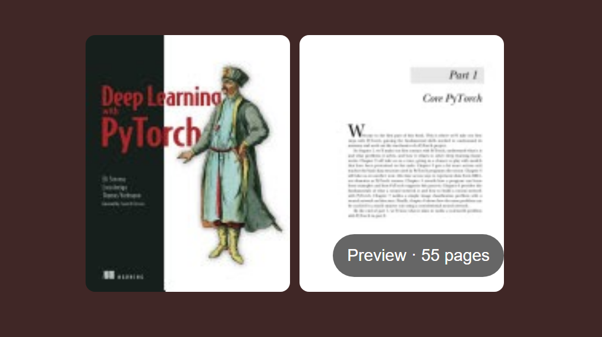
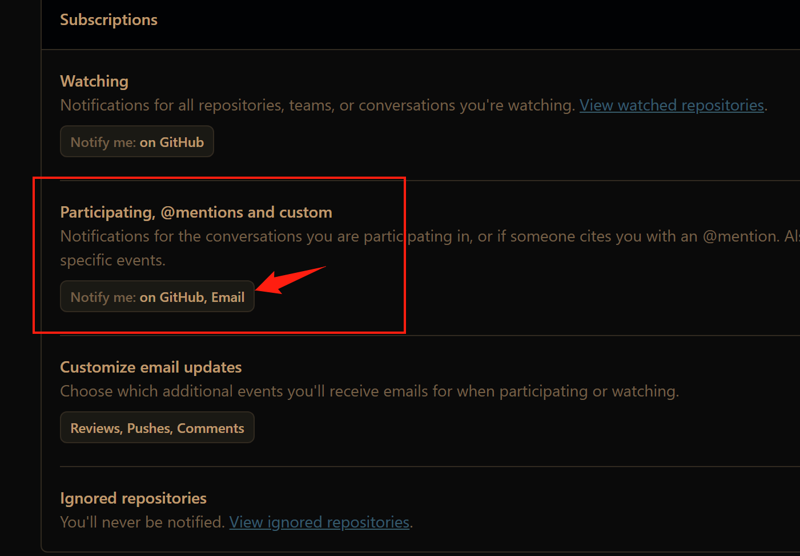
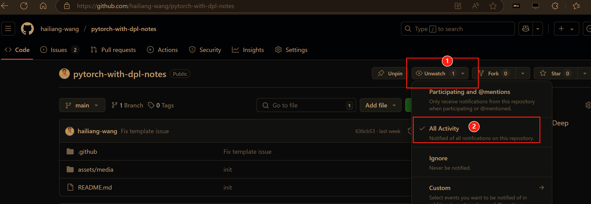

# pytorch-with-dpl-notes

Learning [Deep Learning with PyTorch](https://isip.piconepress.com/courses/temple/ece_4822/resources/books/Deep-Learning-with-PyTorch.pdf).

## discussions

* [Get started](https://github.com/hailiang-wang/pytorch-get-started)
* [Questions](https://github.com/hailiang-wang/pytorch-with-dpl-notes/issues)

## participants

* [Hai Liang W.](https://github.com/hailiang-wang)
* [Hudson Lee](https://github.com/hudsonlee-mtc)

## subscriptions

Set github notifications, choose Email.

Set the repo's Watch.

[https://github.com/hailiang-wang/pytorch-with-dpl-notes](https://github.com/hailiang-wang/pytorch-with-dpl-notes)

Choose `All Activity`.

